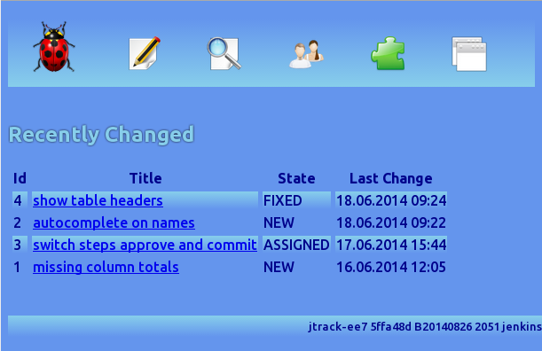

jtrack-ee7
==========

Minimal bugtracker as java ee7 reference project using wildfly 8, gradle, arquillian and spock , and on the JEE side jsf, restful webservices, ejb, jpa and cdi

It is meant to be used in conjunction with the project wildfly-git-install:

https://github.com/martin-welss/wildfly-git-install

which features a wildfly installation from a git repository and externalized local configuration.
For this project, please use the postgres_branch of wildfly-git-install.

BuildId
=======

The gradle build script generates automatically a unique buildId and puts into the META-INF directory of the generated .war file so it can be read and displayed by the application.
The buildId contains the git commit the build is based on, a timestamp an the username:

    jtrack gd67182f B20140622 1851 mw

If git considers the workspace dirty, a * is added:

    jtrack gd67182f*  B20140622 1851 mw

Git tags are automatically associated:

    jtrack V_1_6 gd67182f B20140622 1851 mw

The application displays the buildId in the footer of its web pages, so you can always easily identify the binary your dealing with

Deployment
==========

The deployment-task relies on the environment variable $JBOSS_HOME which should point to the WildFly installation.

The deploy target shows how to deploy by drop-in and check the outcome by evaluating the marker files generated by wildfly and waits until deployment was either successful or failed.

Database
========

For the loadDB target to function properly, you need to have a file $HOME/system.properties which contains the database access parameters like this:

    exampleds.jdbc.url: jdbc:postgresql:example
    exampleds.user: wildfly
    exampleds.password: wildfly

Tests
=====

The tests show just how easy and elegant the source code is using spock and groovy. The following example shows head to read the userlist restful:

    def "read userlist restful"() {
		
		setup:
			def jtrack = new RESTClient( 'http://localhost:8080/jtrack-ee7/items/')
		
		when:
			def response=jtrack.get(path: 'user')
		
		then:
			assert response.status == 200
			assert response.contentType == JSON.toString()
			assert ( response.data instanceof List )
			println response.data
    }

SETUP
=====

Java and Gradle
---------------

First, we need to install Java JDK 1.7 or JDK 1.8 and Gradle 1.12 or 2.0 which can be found at  http://www.gradle.org/downloads. The whole example works without IDE using only the commandline although project files for the Spring Tool Suite are included. I found it always very important to be able to build and test the complete project on the commandline so it can easily be built on every server or workstation of the continuous integration pipeline.  
To install Gradle, just unzip the archive and set the environment variables accordingly. Suppose we have both Java and Gradle installed in /home/opt, our environment variables in .bash_profile or .bashrc should look like this (assuming a Mac or Linux system, Windows users please adjust the syntax accordingly):

    export JAVA_HOME=/home/opt/jdk7
    export GRADLE_HOME=/home/opt/gradle
    export PATH=$JAVA_HOME/bin:$GRADLE_HOME/bin:$PATH
    export JBOSS_HOME=$HOME/wildfly-git-install
    

                                                                              
Database PostgreSQL
-------------------
Please switch to the postgres_branch of wildfly-git-install. We then need to install and configure PostgreSQL: basically, all we need is a valid login into a database via TCP.  Mastertheboss has  of course the adequate tutorial: http://www.mastertheboss.com/jboss-datasource/configuring-a-datasource-with-postgresql-and-jboss/wildfly. The first section is sufficient.Then make sure the system.properties are in your $HOME directory and its contents adjusted to your system.

Get it running
--------------

Start wildfly:

    cd $JBOSS_HOME
    ./bin/standalone.sh --server-config=standalone-full.xml -P=$HOME/system.properties

Then build the application, deploy it and load some testdata:

    cd jtrack-ee7
    gradle loadDB

To run the tests:

    cd jtrack-ee7
    gradle clean loadDB test

    
Jenkins
-------

It is no problem to build the project with the Jenkins Continuous Integration Server. Just install the git, git-client and gradle plugins and configure a new job. Add there the git repository and add a gradle build step with the targets 

    clean loadDB test

     